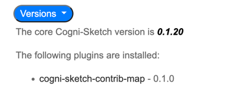
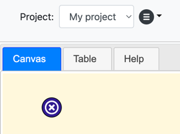
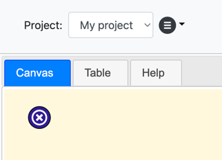
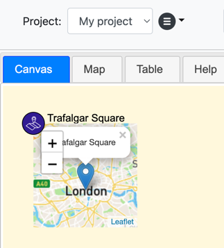
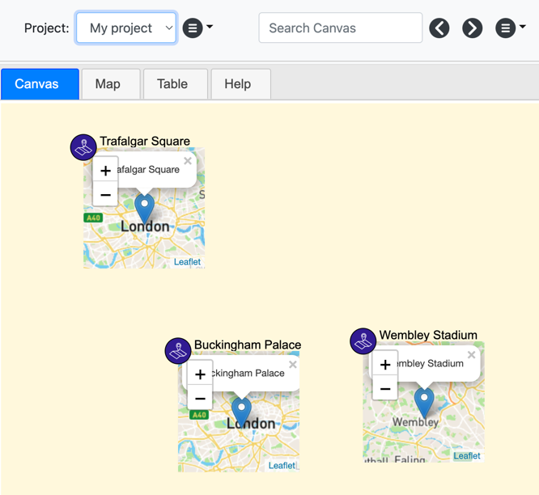

# cogni-sketch-contrib-map
A `location` palette item to capture geospatial information, plus map pane to render all
geospatial information from the canvas.

To add this plugin to the cogni-sketch environment you must do the following:
1. Ensure that this folder is copied or cloned into the `cogni-sketch/plugins` folder.
2. Run `npm install` for this plugin.
3. Edit `cogni-sketch/plugins.js`, adding the following entry to the `plugins` list:
```
    {
        'name': 'cogni-sketch-contrib-map',
        'imports': [
            { 'root': '/leaflet', 'path': '/node_modules/leaflet/dist/' }
        ],
        'scripts': [ '/leaflet/leaflet.js' ],
        'panes': [ 'map' ],
        'stylesheets': [ 'map.css', '/leaflet/leaflet.css' ],
        'client_creds': {
            'mapToken': '(paste your map token here)'
        },
        'actions': [ 'location' ]
    }
```    
4. Replace the `(paste your map token here)` text with
   [a Google Maps key](https://developers.google.com/maps/documentation/javascript/get-api-key)
5. By default the map pane will be located as the first tab in the main container.  If you wish
   to have it appear in a different location simply add a `'map'` string to the `paneOrder`
   property in `plugins.js`.
6. Optionally, add the location item to any palette by pasting in the following to any palette file, setting `section` and `position` values as needed (see also `examples\palette_item_location.json` for a copy of this text):
```
  "location": {
   "id": "location",
   "section": "core",
   "position": 10,
   "icon": "./images/palette/icon-location.svg",
   "icon-alt": "icon-location",
   "label": "location",
   "nodeColor": "blue",
   "settings": {
    "canChangeTypeAfterCreation": true,
    "defaultMapWidth": "50px",
    "dropPartials": [
     "/maps/place"
    ]
   }
```
6. Restart the cogni-sketch service.

##Testing

### Canvas location nodes
To check that the plugin has been correctly installed (after following the instructions above),
navigate to the help tab and the `Versions` section.  You should see the map plugin listed
along with the version, similar to this:



To test this plugin simply copy or drag/drop a Google Maps url onto the canvas, for example:

[Trafalgar Square, London](https://www.google.co.uk/maps/place/Trafalgar+Square/@51.5080917,-0.1291379,18z/data=!3m1!4b1!4m6!3m5!1s0x487604ce3941eb1f:0x1a5342fdf089c627!8m2!3d51.508039!4d-0.128069!16zL20vMGdzeHc)

If the map plugin is not enabled and the location palette item type has not been added then the
copied/dropped url will be treated simply as a url and will look like this:



You can also see that the map pane is not appearing, which also indicates that the map plugin
is not enabled.

If the location palette item type has been added but the map plugin has not yet been added then
the copied/dropped url will look like this because it is correctly matching to a location
palette item, but the logic for processing the location url is not yet available:



Again you see that the map pane is also not appearing.

However, if the map plugin is installed and the location palette item type has been added to the
current palette then the canvas will look like this when that example url is copied or dropped:



If you notice that the small map is not being rendered behind the pin then it is likely because
you hav not specified your google map API key as part of the map plugin JSON.

### The map pane
If you add a few more nodes to the canvas:

[Buckinham Palace, London](https://www.google.co.uk/maps/place/Buckingham+Palace/@51.5013673,-0.1440787,17z/data=!3m2!4b1!5s0x487605276d38fb6b:0xe1c60228d7946675!4m6!3m5!1s0x48760520cd5b5eb5:0xa26abf514d902a7!8m2!3d51.501364!4d-0.14189!16zL20vMDE5OGc)
[Wembley Stadium, London](https://www.google.co.uk/maps/place/Wembley+Stadium/@51.556028,-0.2818064,17z/data=!3m2!4b1!5s0x48761181d3a805e3:0x9d43d00915aa8b10!4m6!3m5!1s0x48761181d57a876d:0xa64f9f185de8e097!8m2!3d51.5560247!4d-0.2796177!16s%2Fm%2F027pds6)

Like this:



Then when you navigate to the map pane you should see these three nodes rendered on the map:


Clicking on the node on the map pane will navigate you to the canvas tab with that node selected,
enabling you to explore connections and properties for that node.  if you change details on the
canvas pane (e.g. the node type or color, or the label) then these will be reflected on the map
pane when you navigate back.

Don't forget that you can hide the mini map on the canvas by selecting the node and then using
the space bar to cycle through the three visualisation modes for a node (map, table, none).

Note: the `dropPartials` property in the location palette item JSON specifies the fragments of
any url that will determine that the url should be treated as a location.  You can add (or
edit/remove) these to modify the urls that will be treated as location nodes.
