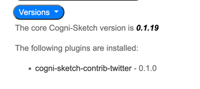
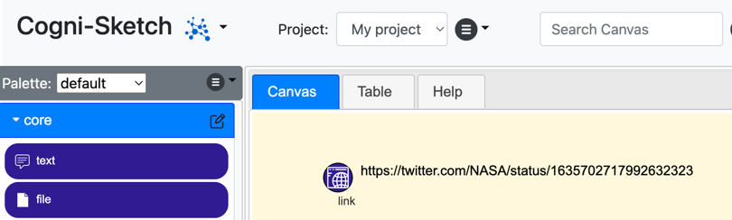

# cogni-sketch-contrib-twitter
Twitter integration for the cogni-sketch environment.

Adds support for a `tweet` palette item type that is used to dynamically render tweets onto
the canvas.  Either copy or drop a tweet url onto the canvas or drop an empty tweet palette
item onto the canvas, and then copy/drop the tweet url onto that
(e.g. [this tweet](https://twitter.com/NASA/status/1635702717992632323)). The tweet will then be rendered on the canvas in the same styling as twitter,
and various properties will be added to the node (tweet author, hashtags, etc.).

##Installation
To add this plugin to the cogni-sketch environment you must do the following:
1. Ensure that this folder is copied or cloned into the `cogni-sketch/plugins` folder.
2. Run `npm install` for this plugin.
3. Edit `cogni-sketch/plugins.js`, adding the following entry to the `plugins` list:
```
        {
            "name": 'cogni-sketch-contrib-twitter',
            "routes": [
                { "root": '/tweet', "path": 'tweet.js' }
            ],
            "scripts": [
                '/plugins/cogni-sketch-contrib-twitter/scripts/twitter.js'
            ],
            "stylesheets": [ 'twitter.css' ],
            "actions": [ 'tweet' ]
        }
```   
4. Optionally, add the tweet item to any palette by pasting in the following to any palette
   file, replacing `section` and `position` with correct values with as needed (see also
   `examples\palette_item_tweet.json` for a copy of this text):
```
  "tweet": {
    "id": "tweet",
    "section": "(section name)",
    "position": -1,
    "icon": "/plugins/cogni-sketch-contrib-twitter/images/icon-tweet.svg",
    "icon-alt": "icon-tweet",
    "label": "tweet",
    "nodeColor": "blue",
    "settings": {
      "canChangeTypeAfterCreation": true,
      "tweetScale": 1,
      "dropPrefixes": [
        "http://twitter.",
        "https://twitter."
      ],
      "defaultWidth": "100px",
      "tweetService": "tweet?url="
    }
  }
```
5. Restart the cogni-sketch service.

##Testing
To check that the plugin has been correctly installed (after following the instructions above),
navigate to the help tab and the `Versions` section.  You should see the
twitter plugin listed along with the version, similar to this:



To test this plugin simply copy or drag/drop a tweet url onto the canvas, for example:

```
https://twitter.com/NASA/status/1635702717992632323
```

If the twitter plugin is not enabled the canvas will look like this:



If the twitter plugin is enabled, but the tweet palette item has not been added to the palette
then the url will also look like the plain example above.

However, if the plugin is installed and the tweet palette item has been added to the current
pallete then the canvas will look like this when that example url is copied or dropped:


